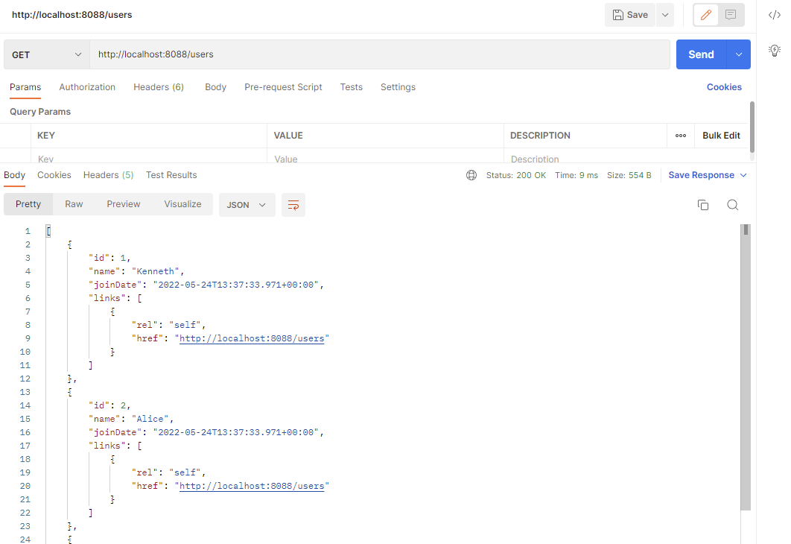
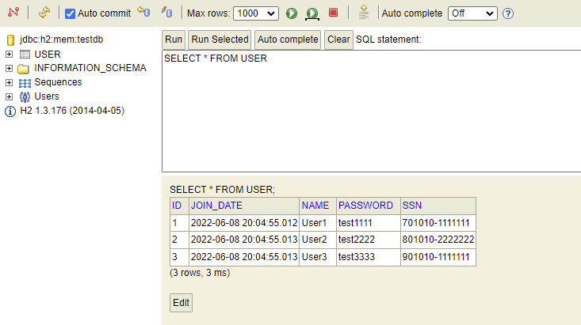

# Spring Boot 를 이용한 RestFul Web Services 개발

<hr />
<hr />

+ 스프링 부트 설정 파일
  + properties
    + 단일라인 구성 (name=value)
    + ```properties
       example.jdbc.url=127.0.0.1 
       example.jdbc.port=3306 
       example.jdbc.user=user 
       example.jdbc.password=password 
      ```
    
  + yml
     + 계층적 구조 형태
     + 들여쓰기로 계층 구조 
     + ```yaml
        example: 
         jdbc: 
          url: 127.0.0.1 
          port: 3306 
          user: user 
          password: password
       ```

<hr />

Spring Boot 동작 관련 method
+ DispatcherServletAutoConfiguration
  + DispatcherServlet 관리하는 자동 관리 메소드 
  + DispatcherServlet : 사용자의 요청을 처리하는 게이트웨이 역활
  
+ HttpMessageConvertersAutoConfiguration
  + 사용자(클라이언트) 에게 요청한 결과 Json 형태로 변환하여 반환하는 설정 메소드

<hr />


DispatcherServlet
- 클라이언트의 모든 요청을 한곳으로 반아서 처리
- 요청에 맞는 Handler 로 요청을 전달
- Handler 의 실행 결과를 Http Response 형태로 만들어서 반환


RestController
- Spring4 부터 @RestController 지원
- View 를 갖지 않는 REST Data(JSON/XML) 를 반환


<hr />

ServletUriComponentsBuilder
+ 특정 값을 포함한 URI를 전달 해야 할 때 사용
+ 사용자가 요청한 URI를 가져온 다음 path를 통해 원하는 정보를 입력
+ buildAndExpand에 원하느 값을 넣어주면 path({변수})에 추가되어 UIR가 구성
+ ResponseEntity를 통해 사용자에게 전달
```java
    @PostMapping("/users")
    public ResponseEntity<User> createUser(@RequestBody User user) {
        User savedUser = service.save(user);
        URI location = ServletUriComponentsBuilder.fromCurrentRequest()
                .path("/{id}")
                .buildAndExpand(savedUser.getId())
                .toUri();
        return ResponseEntity.created(location).build();
    }
```


<hr />

AOP를 활용한 예외 처리(@ControllerAdvice)
```JAVA
@ControllerAdvice // 모든 컨트롤러가 실행될때 반드시 Advice 가지는 Bean 을 찾아내서 실행하게 됨 -> 전역에서 발생하는 예외를 잡아 처리 할 수 있음 ,AOP(관점지향프로그래밍) 활용
public class CustomizedResponseEntityExceptionHandler extends ResponseEntityExceptionHandler {

    @ExceptionHandler(Exception.class)
    public final ResponseEntity<Object> handleAllExceptions(Exception ex, WebRequest request) {
        ExceptionResponse exceptionResponse = new ExceptionResponse(new Date(), ex.getMessage(), request.getDescription(false));
        return new ResponseEntity(exceptionResponse, HttpStatus.INTERNAL_SERVER_ERROR);
    }
}

```

<hr />

Validation API 사용
+ Spring 2.3 이후 starter web에 validation이 빠져있으므로 pom.xml 추가필요
```xml
<dependency>
   <groupId>org.springframework.boot</groupId>
   <artifactId>spring-boot-starter-validation</artifactId>
</dependency>
```

사용자 측 입력 유효성 오류이므로 400번 Error Code 전송함


<details> 
<summary>상세목록 접기/펼치기</summary>

| 1 | 2  | 3 | 4 |
|---|----|-----|----|
| @AssertTrue | Boolean, boolean | 값이 항상 True 여야 한다 ||
| @DecimalMax | 실수 제외 숫자 클래스 | 지정된 최대 값보다 작거나 같아야 하는 숫자이다 | String : value (max 값을 지정한다) |
| @DecimalMin | 실수 제외 숫자 클래스 | 지정된 최소 값보다 크거나 같아야하는 숫자이다 | String : value (min 값을 지정한다) |
| @Digits | BigDecimalBigIntegerCharSequencebyte, short, int, long, 이에 대응하는 Wrapper 클래스 | 허용된 범위 내의 숫자이다 | int : integer (이 숫자에 허용되는 최대 정수 자릿수) <br/> int : fraction (이 숫자에 허용되는 최대 소수 자릿수) |
| @Email | null도 valid로 간주된다 | 올바른 형식의 이메일 주소여야한다 ||
| @Future | 시간 클래스 | Now 보다 미래의 날짜, 시간 ||
| @FutureOrPresent | 시간 클래스 | Now 보다 미래의 시간이거나 미래의 날짜, 시간 ||
| @Past | 시간 클래스 | Now 보다 과거의 날짜, 시간 ||
| @PastOrPresent | 시간 클래스 | Now 보다 과거의 시간이거나 미래의 날짜, 시간 ||
| @Max | 실수 제외 숫자 클래스 | 지정된 최대 값보다 작거나 같은 숫자이다 | long : value (max 값을 지정한다) |
| @Min | 실수 제외 숫자 클래스 | 지정된 최소 값보다 크거나 같은 숫자이다 | long : value (min 값을 지정한다) |
| @Negative | 숫자 클래스 | 음수인 값이다 |
| @NegativeOrZero | 숫자 클래스 | 0이거나 음수인 값이다 |
| @Positive | 숫자 클래스 | 양수인 값이다 ||
| @NPositiveOrZero | 숫자 클래스 | 0이거나 양수인 값이다 ||
| @NotBlank | null 이 아닌 값이다 | 공백이 아닌 문자를 하나 이상 포함한다 ||
| @NotEmpty | CharSequence,Collection, Map, Array | null이거나 empty(빈 문자열)가 아니어야 한다 ||
| @NotNull | 어떤 타입이든 수용한다 | null 이 아닌 값이다 ||
| @Null | 어떤 타입이든 수용한다 | null 값이다 ||
| @Pattern | 문자열 | 지정한 정규식과 대응되는 문자열이어야한다 <br/> Java의 Pattern 패키지의 컨벤션을 따른다 | String : regexp (정규식 문자열을 지정한다) |
| @Size | CharSequence,Collection, Map, Array | 크기가 지정된 경계(포함) 사이에 있어야한다 (ex: @Size(min="2", max="10") ) | int : max (element의 크기가 작거나 같다) <br/> int : min (element의 크기가 크거나 같다) |

</details>


<hr/>

다국어 처리를 위한 Internationalization 구현

+ Default Locae 설정(Main Controller)
```JAVA
@Bean
public SessionLocaleResolver localResolver() {
    SessionLocaleResolver localeResolver = new SessionLocaleResolver();
    localeResolver.setDefaultLocale(Locale.KOREA);
    return localeResolver;
    }
 ```

+ 리소스 파일을 통해 언어 설정(properties) 등록 가능, properties 파일 문자인코딩 주의(UTF-8)
+ Controller를 활용한 Locale 문자 처리
```JAVA
@Autowired // 어노테이션을 통한 의존성 주입
private MessageSource messageSource;

@GetMapping(path = "/hello-world-internationalized")
public String helloWorldInternationalized(@RequestHeader(name = "Accept-Language", required = false) Locale locale) {
    return messageSource.getMessage("greeting.message", null, locale);
}
```


<hr/>

XML Format 형식 반환

+ Dependency 설정하지 않았을때 XML 요청시 아래와 같이 406 Not Acceptable 이 반환됨


Dependency 추가시 정상 반환 가능
```xml
<dependency>
    <groupId>com.fasterxml.jackson.dataformat</groupId>
    <artifactId>jackson-dataformat-xml</artifactId>
    <version>2.13.3</version>
</dependency>
```


<hr/>
Response Filtering

+ 필터링 X

 
+ 필드값 단위 : @JsonIgnore

```java

@Data
public class User {
...
  @JsonIgnore
  private String password;

  @JsonIgnore
  private String ssn;
}
```
+ 클래스 블록 단위 : @JsonIgnoreProperties
```java
@JsonIgnoreProperties(value = {"password", "ssn"})
public class User {
...
  private String password;

  private String ssn;
}
```


<hr/>
REST API Version Control

```java
@GetMapping("/v1/users/{id}") // URI 값을 활용한 버전 관리
@GetMapping(value = "/users/{id}/", params = "version=1") // request parameter를 활용한 버전 관리
@GetMapping(value = "/users/{id}", headers = "X-API-VERSION=1") // request header를 활용한 버전 관리
@GetMapping(value = "/users/{id}", produces = "application/vnd.company.appv1+json") // produces 를 활용한 방법 (MIME 타입 (Multipurpose Internet Mail Extensions))
```


+ URI 값이 지저분하거나 과도한 정보를 주는지 주의
+ 잘못된 헤더값을 주는지 확인
+ 인터넷 웹브라우저 남은 캐시값을 확인하며 개발(새로운 반영시)
+ 웹브라우저 호환성 확인
+ API 개발 문서 작성

<hr/>

HATEOAS - Hypermedia As the Engine Of Application State
+ 현재 리소스와 연관된(호출 가능한) 자원 상태 정보를 제공

+ HATEOAS를 적용한 Response



<hr/>
Swagger

```xml
# SpringBoot 2.6.7 버전 기준 pom.xml dependency 추가
<dependency>
    <groupId>io.springfox</groupId>
    <artifactId>springfox-boot-starter</artifactId>
    <version>3.0.0</version>
</dependency>
```

```yaml
# 2.6버전 이후 ant_apth_matcher 에서 path_pattern_parser 로 변경 되면서 몇 몇 라이브러리에 경로 설정 이 필요함
spring:
  mvc:
    pathmatch:
      matching-strategy: ant_path_matcher
```

+ Swagger 2.0 접속 주소
  + (http://localhost:8088)/swagger-ui/index.html

<hr/>
Actuator (Spring Boot Monitoring Tool)

+ 어플리케이션을 모니터링 하고 관리하는 기능 (Spring Boot 자체 제공)

+ SpringFox 라이브러리 문제 관련 해결
  + https://github.com/springfox/springfox/issues/3462#issuecomment-1070387054

<hr/>

~~HAL Browser~~ (Deprecated) -> HAL Explorer

+ Hypertext Application Language
+ API의 리소스들 사이에 쉽고 일관적인 하이퍼링크를 제공하는 방식
+ 메타정보를 하이퍼링크 형식으로 간단하게 표현 가능


HATEOS 정보(Links정보) 가 같이 나타나남

<hr/>
Spring Security

```xml
<dependency>
  <groupId>org.springframework.boot</groupId>
  <artifactId>spring-boot-starter-security</artifactId>
</dependency>


```
기본 생성 password (boot 실행시 logger에 나옴)


username / password 변경처리

```java
@Configuration
public class SecurityConfig extends WebSecurityConfigurerAdapter {

    @Autowired
    public void configureGlobal(AuthenticationManagerBuilder auth) throws Exception {
        auth.inMemoryAuthentication()
                .withUser("kenneth")
                .password("{noop}test1234")
                .roles("USER");
    }
}
```

<hr/>

<br/>
JPA
+ Java Persistence API
+ 자바 ORM 기술에 대한 API 표준 명세
+ 자바 어플리케이션에서 관계형 데이터베이스를 사용하는 방식을 정의한 인터페이스
+ EntityManager를 통해 CRUD 처리

Hibernate
+ EJB를 대체하기위해 나온 ORM 프레임워크
+ JPA의 구현체, 인터페이스를 직접 구현한 라이브러리
+ 생산성, 유지보수, 비종속성

Spring Data JPA
+ Spring Module
+ JPA를 추상화한 Repository 인터페이스 제공

==> 보다 적은량의 코드를 통해 데이터베이스를 연동한 프로그램 개발 가능3

H2 Database
+ 자바기반의 오픈소스 관계형 DB
+ 인메모리 DB 기능 지원 <br/>


```java
@Entity
public class User {

  @Id
  @GeneratedValue
  private Integer id;
  ...
}
```


+ 스프링 부트 시작 시점 insert 문 실행 (resources > data.sql)
(https://www.inflearn.com/questions/260596)

